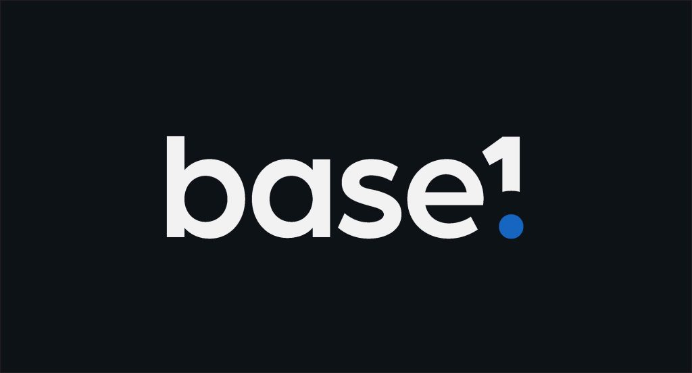
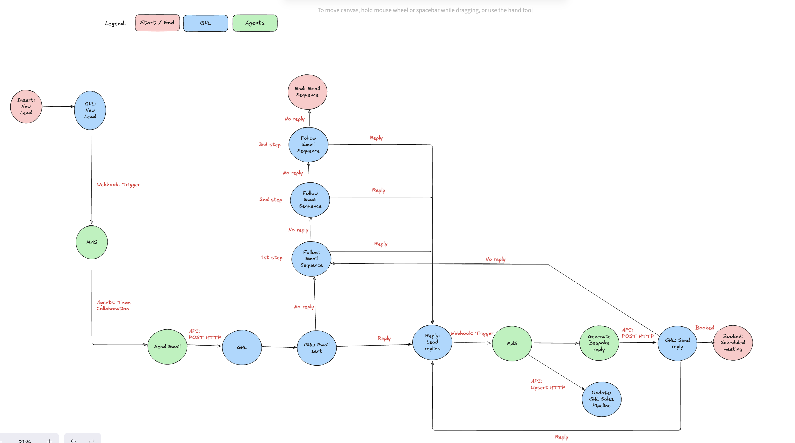
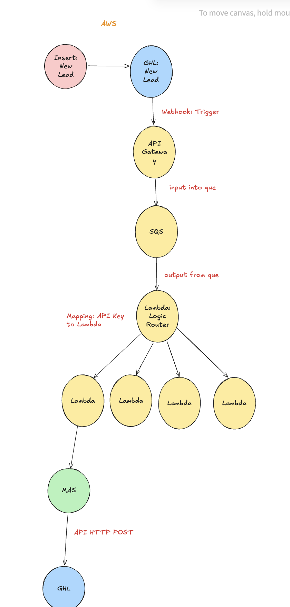

#   BaseOne Crew – Email Automation Agents

## 📚 Table of Contents
- [📖 Overview](#overview)
- [🧩 Solution Overview](#-solution-overview)
- [🏗 Workflow Architecture](#-workflow-architecture)
- [🏗 AWS Architecture](#-aws-architecture)
- [💰 Cost](#-sample-monthly-cost-breakdown-100000-emails-processed)
  - [💰 Sample Monthly Cost Breakdown (100,000 Emails Processed)](#-sample-monthly-cost-breakdown-100000-emails-processed)
- [🚀 Installation](#-installation)
- [⚙️ Configuration & Customisation](#️-configuration--customisation)
- [▶️ Running the Project](#️-running-the-project)
- [👥 Understanding Your Crew](#-understanding-your-crew)
- [📞 Support](#-support)
- [✅ Final Notes](#-final-notes)

---
<a name="Overview"></a>
## Overview
Welcome to the **BaseOne Email Automation Agents Crew** project, powered by [Sensai](https://sensai-consulting.com).  
This template is built to **automate email campaigns, responses, and communication** across various modalities using agentic AI workflows.

This solution is built to:
- Personalise outreach and campaign communication
- Respond intelligently to customer replies
- Provide data-driven insights and summaries
- Coordinate multiple autonomous agents via a unified task flow

It seamlessly integrates with your existing CRM and marketing tools, reducing time and complexity in building sophisticated multi-agent LLM applications.

---
<a name="Solution Overview"></a>
## 🧩 Solution Overview 

This solution is powered by [Sensai](https://sensai-consulting.com) using a Python-based orchestration layer using [CrewAI](https://docs.crewai.com). It automates email campaign generation and handling through a crew of AI agents, each assigned specialised tasks.

Agents are configured via structured YAML definitions and interact through event-driven flows defined in `main.py`. The AI models used can include OpenAI's GPT-4, Anthropic’s Claude, or any Bedrock-supported foundation models for AWS deployments.

### Key Capabilities:
- Multi-step orchestration of campaign generation and follow-ups
- Intelligent summarisation of replies and lead insights
- Integration-ready structure for CRMs and outreach platforms like GoHighLevel
- Structured prompts and validation templates to avoid LLM hallucinations

Anti-hallucination techniques used:
- Clear step-by-step agent instructions
- Agent memory and validation flows (e.g., self-check prompts)
- Defined schema for outputs (via Pydantic models)
- Controlled interaction via UI forms and input sanitisation

---
<a name="Workflow Architecture"></a>
## 🏗 Workflow Architecture 



<a name="AWS Architecture"></a>
## 🏗 AWS Architecture 


<a name="Costs"></a>
## 💰 Sample Monthly Cost Breakdown (100,000 Emails Processed)

| **AWS Service**              | **Usage Description**                                   | **Cost (USD)** |
|-----------------------------|----------------------------------------------------------|----------------|
| Amazon API Gateway          | 1,000,000 REST API calls                                 | $3.50          |
| Amazon Cognito              | 1,000 active users                                       | $0.00          |
| Amazon S3                   | 100 GB storage, PUT/GET requests                         | $2.47          |
| AWS Lambda                  | 500,000 requests (60ms, 1024MB)                          | $0.00          |
| Amazon CloudWatch Logs      | 15 GB logs                                               | $7.57          |
| Bedrock Agent (Claude 3)    | 100,000 queries (~6K in / 500 out tokens each)           | $2,550.00      |
| **Total**                   |                                                          | **$2,563.54**  |

> **AWS Pricing Calculator**: Use AWS calculator for up-to-date pricing [**AWS Calculator**](https://calculator.aws/#/)
<a name="Installation"></a>
## 🚀 Installation

> **Requirements**: Python `>=3.10` and `<3.13`

This project uses [**UV**](https://docs.astral.sh/uv/) for fast dependency management and environment handling.

### 1. Install `uv` (if not already installed)

```bash
pip install uv
```

### 2. Navigate to the project directory

```bash
cd baseone-crew
```

### 3. Install project dependencies

```bash
crewai install
```

> _This will lock and install the required packages automatically._

---

<a name="Configuration & Customisation"></a>
## ⚙️ Configuration & Customisation

Before running, ensure you've set up your `.env` file with the required API keys.

### 🔑 Add API Keys

- Add your `OPENAI_API_KEY` to the `.env` file at the root of the project.
- Add your `GHL_ACCESS_TOKEN` to the `.env` file at the root of the project.

### 🛠️ Define Your Agents and Tasks

You can customise agents, tasks, logic, tools, and input configurations:

| Component | File | Purpose | Links |
|-----------|------|---------|-------|
| Anlayst Crew Agents | `src/baseone_agents/analyst_crew/config/agents.yaml` | Define Analyst Crew agents | https://docs.crewai.com/concepts/agents |
| Email Crew Agents | `src/baseone_agents/email_crew/config/agents.yaml` | Define Email Crew agents | https://docs.crewai.com/concepts/agents |
| Anlayst Crew Tasks | `src/baseone_agents/analyst_crew/config/tasks.yaml` | Define Analyst Crew tasks | https://docs.crewai.com/concepts/tasks |
| Email Crew Tasks | `src/baseone_agents/email_crew/config/tasks.yaml` | Define Email Crew tasks | https://docs.crewai.com/concepts/tasks |
| Crew | `src/baseone_agents/crew.py` | Define overall logic, custom tools, and arguments | https://docs.crewai.com/concepts/crews | 
| Main Script| `src/baseone_agents/main.py` | Add your own CLI or input logic | https://docs.crewai.com/quickstart#build-your-first-crewai-agent |
| Custom Tools | `src/baseone_agents/tools/custom_tool.py` | Add custom tools (e.g., GHL BaseTool, BaseModel) | https://docs.crewai.com/concepts/tools#creating-your-own-tools |
| Flows Class | `src/baseone_agents/main.py` | Flow class in the main.py file allows you to create structured, event-driven workflows. They provide a seamless way to connect multiple tasks, manage state, and control the flow of execution in your AI applications. | https://docs.crewai.com/concepts/flows |

> We're using [**Pydantic**](https://docs.pydantic.dev/latest/) for consistent, validated data ingestion and flow between agents.

---

<a name="Running the Project"></a>
## ▶️ Running the Project

Once configured, start the automation flow from the root directory:

```bash
crewai run
```

This will launch the `baseone_agents` flow and activate your defined agents and tasks.

---

<a name="Understanding Your Crew"></a>
## 👥 Understanding Your Crew

The **BaseOne Crew** is a set of autonomous AI agents, each assigned a specific role and goal. These agents collaborate through a defined set of tasks to execute complex workflows.

<a name="Components Overview"></a>
### 🧩 Components Overview

- **Agents Config:**  
  `src/baseone_agents/analyst_crew/config/agents.yaml`  
  `src/baseone_agents/email_crew/config/agents.yaml`

- **Tasks Config:**  
  `src/baseone_agents/analyst_crew/config/tasks.yaml`  
  `src/baseone_agents/email_crew/config/tasks.yaml`

- **Custom Logic & Tools:**  
  `src/baseone_agents/tools/custom_tool.py` includes initial tools like **GHL BaseTool** and **BaseModel**.

---

<a name="Support"></a>
## 📞 Support

Need help or have feedback?

- 📧 Email: [support@sensai-consulting.com](mailto:support@sensai-consulting.com)  
- 📚 Documentation: [CrewAI Docs](https://docs.crewai.com)

---

<a name="Final Notes"></a>
## ✅ Final Notes

Make sure to:

- **Updates:** Regularly update the agent/task configurations as your workflow evolves.
- **Dependancies:** Keep dependencies up to date with `crewai install` as needed.
- **Docker:** Make sure to run your application within a Docker container to enable code execution within a safe environment and to isolate workflow processes.  This enables scalability and conforms to the best practises for production ready applications.
- **Improvements:** Reach out to the Sensai team for strategic improvements or bespoke automation needs.


---

**Built by SensAI **  
_Elevating enterprise efficiency through agentic intelligence_
